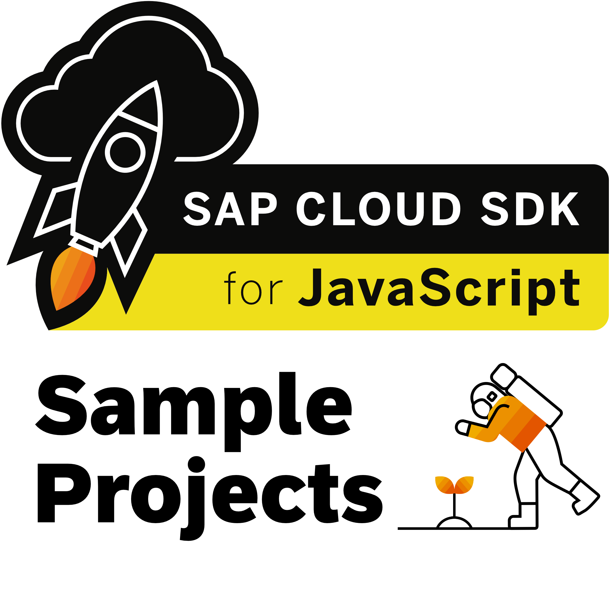

# SAP Cloud SDK  Samples

## Description

This repository contains code samples showcasing the [SAP Cloud SDK for JavaScript / TypeScript](https://sap.github.io/cloud-sdk/js).
We plan to increase the number of samples over time. 
The samples will serve different purposes:
- There will be simple "Hello World" applications. They will contain a complete project with all configurations needed to execute it.
- There will be code samples to be used in an existing project. These samples do not work on their own but illustrate how to use the SAP Cloud SDK.
- There will be solutions to tutorials or training courses. These applications have larger scopes and showcase the business value you can create using the SAP Cloud SDK. 

## Requirements

The minimal requirements are:
- A terminal to execute commands
- A recent version of node and npm installed e.g. node 14 and npm 6
- An IDE or a text editor of your choice

If you want to explore the possibilities beyond local tests you need:
- Access to a [SAB Business Technology Platform](https://www.sap.com/products/business-technology-platform.html) account
- Entitlement to use resources like service instance creation and application processing units
- Permission to deploy applications and create service instances

## Support

If you find a bug or have questions about the concrete content of this repository [create an issue here](https://github.com/SAP-samples/<repository-name>/issues). 
If you have a general question about a feature of the SDK [create an issue in the SAP Cloud SDK repository](https://github.com/SAP/cloud-sdk-js/issues) 

## Contributing

If you wish to contribute code, offer fixes or improvements, please send a pull request.
Due to legal reasons, contributors will be asked to accept a DCO when they create the first pull request to this project.
This happens in an automated fashion during the submission process. SAP uses [the standard DCO text of the Linux Foundation](https://developercertificate.org/).

## Code of Conduct

For this repository the [code of conduct](https://github.com/SAP/cloud-sdk-js/blob/2.0/CODE_OF_CONDUCT.md) of the SDK applies.

## License
Copyright (c) 2021 SAP SE or an SAP affiliate company. All rights reserved. This project is licensed under the Apache Software License, version 2.0 except as noted otherwise in the [LICENSE](LICENSES/Apache-2.0.txt) file.
