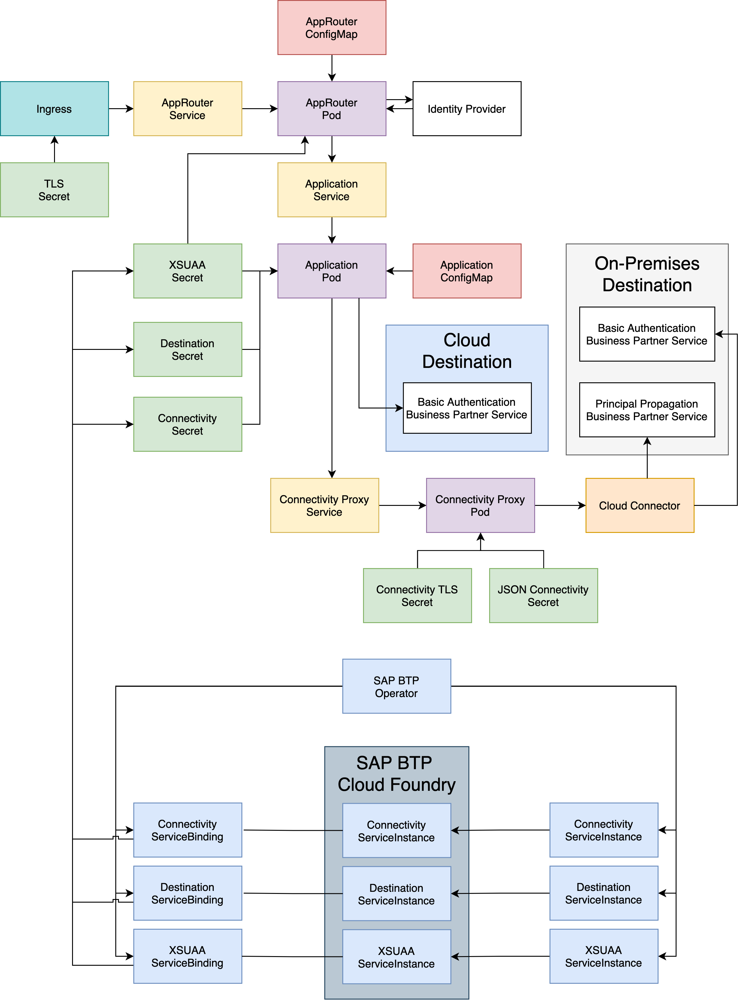

# SAP Cloud SDK for JS Kubernetes End-2-End Application

This repository contains our end-2-end application which we use to test the sdk's functionality in a Kubernetes environment.
The application is deployed together with our Helm chart located [here](https://github.tools.sap/cloudsdk/k8s-sdkjs-chart/blob/main/README.md).

The repositories structure is as following:

- `/approuter` - Contains the approuter, a packaging script and a Dockerfile which is used in the deployment
- `/pipeline` - Contains the pipeline's Dockerfile which contains all tools to run the pipeline
- `/src` - Contains the application's source code with its 4 endpoints for cloud, onpremise and principal propagation
- `/e2e-tests` - Contains the cypress tests that test all endpoints after deployment
- `./github/workflows` - Contains the pipeline that builds, packages, deploys and tests the application
- `Dockerfile` - Packages the application as Dockerimage to be used in Kubernetes

If you want to locally trigger the e2e-tests, create a `cypress.env.json` file in the `/e2e-tests` directory containing the credentials for the IdP in the format:

```
{
  "user": "username",
  "password": "password"
  "url": "url"
}
```
## Requirements
The minimal requirements are:
- A terminal to execute commands
- A recent version of node and npm installed e.g. node 14 and npm 6
- An IDE or a text editor of your choice

If you want to explore the possibilities beyond local tests you need:
- Access to a [SAP Business Technology Platform](https://www.sap.com/products/business-technology-platform.html) account
- Entitlement to use resources like service instance creation and application processing units
- Permission to create service instances
- Access to a `Docker` repository
- A Kubernetes Cluster which runs:
  - The SAP BTP Operator
  - The SAP Connectivity Proxy
## Download and Installation
To download the application run:

```
git clone \
  --depth 1  \
  --filter=blob:none  \
  --sparse \
  https://github.com/SAP-samples/cloud-sdk-js.git \
;
cd cloud-sdk-js
git sparse-checkout set samples/helm-sample-application
```

### Deploy to Docker
1. In the `package.json`, change the `deploy:docker` and `deploy:pipeline` scripts to point at your docker repository.
2. Change the the `deploy:docker` script in the approuter's `package.json` to point at your docker repository.
3. Deploy the Docker images to your repository with `npm run deploy:docker` and `npm run deploy:pipeline` in case you want to use the pipeline.

### Deploy to Kubernetes

To deploy this application to Kubernetes, first you have to deploy all the services this application has to use, which includes:
- the `connectivity` service
- the `xsuaa` service
- the `destination` service

To deploy them simply `kubectl apply -f` the yaml files under `sap-btp-operator/services`.

After deploying the services, all you have to do is editing the `values.yaml` file under `helm-chart`.
The helm chart's [README](../helm-chart/README.md) should explain to you what values you can use and which you have to change.

Once you have changed the `values.yaml`, run `helm install e2e-app k8s-e2e-app-helm-0.1.5.tgz --values values.yaml` and you should be good to go.

For more detailed information on Kubernetes deployment, check out our [Kubernetes migration guide](https://sap.github.io/cloud-sdk/docs/js/guides/migrate-sdk-application-from-btp-cf-to-kubernetes).

The architecture of this application, together with its dependencies, the connectivity proxy, and the services created by the sap-btp-operator, is depicted in the following architecture diagram:


